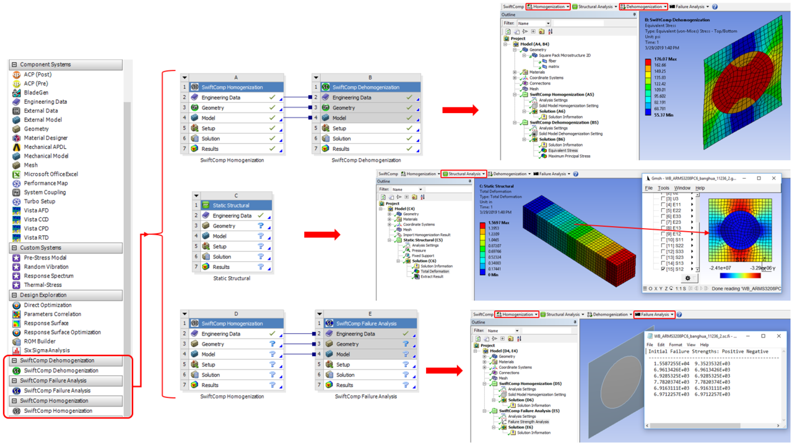
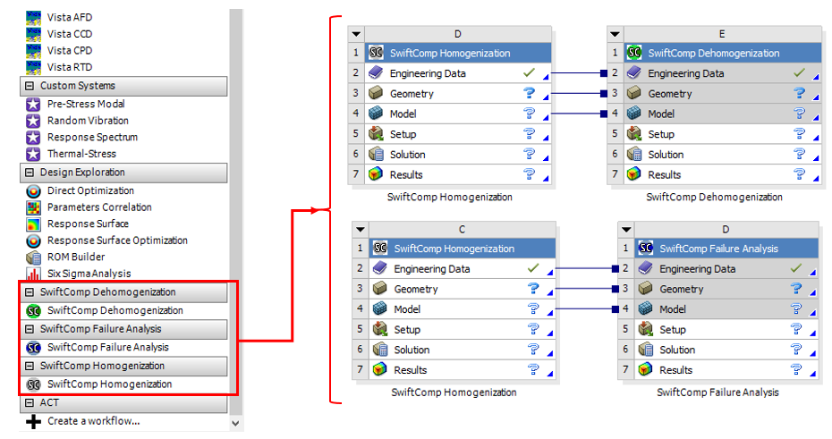

# ANSYS Workbench-SwiftComp GUI

[](https://opensource.org/licenses/MIT)
[](https://www.python.org/)
[](https://www.ansys.com/)

**ANSYS Workbench-SwiftComp GUI** is an extension for ANSYS Workbench designed to facilitate multiscale modeling and simulation of composite materials and structures. This tool integrates SwiftComp, a powerful multiscale constitutive modeling tool, directly within the ANSYS Workbench environment, streamlining the analysis process.

For more information, visit this article: [ANSYS Workbench-SwiftComp GUI Extension for Multiscale Modeling](https://www.linkedin.com/pulse/ansys-workbench-swiftcomp-gui-extension-multiscale-modeling-zhao/)



## 📋 Table of Contents

- [ANSYS Workbench-SwiftComp GUI](#ansys-workbench-swiftcomp-gui)
  - [📋 Table of Contents](#-table-of-contents)
  - [✨ Features](#-features)
  - [🔧 Prerequisites](#-prerequisites)
  - [📦 Installation](#-installation)
    - [Method 1: Using the Extension File (Recommended)](#method-1-using-the-extension-file-recommended)
    - [Method 2: From Source](#method-2-from-source)
  - [🚀 Quick Start](#-quick-start)
  - [📚 Documentation](#-documentation)
  - [🎯 Examples](#-examples)
  - [📁 Project Structure](#-project-structure)
  - [🤝 Contributing](#-contributing)
  - [📄 License](#-license)
  - [📞 Contact](#-contact)

## ✨ Features

- **Multiscale Constitutive Modeling**: Supports modeling and analysis of composite materials at both micro and macro scales, enabling accurate and efficient simulations
- **Seamless Integration**: Fully integrated with ANSYS Workbench, providing a cohesive environment for setting up and running multiscale simulations
- **Homogenization**: Computes effective material properties, bridging the gap between microstructure and macroscopic behavior
- **Dehomogenization**: Recovers local field information from global analysis results, allowing detailed insight into microstructural behavior
- **User-Friendly Interface**: Intuitive GUI that simplifies the workflow, making it accessible to both novice and experienced users
- **Multiple Analysis Types**: Supports beam, plate, and solid models for comprehensive structural analysis
- **Failure Analysis**: Integrated failure criteria and strength analysis capabilities
- **Visualization Tools**: Built-in visualization features for results interpretation



## 🔧 Prerequisites

- **ANSYS Workbench** (compatible versions: 2020 R1 and later)
- **Python** 3.x (required for ACT extensions)
- **SwiftComp** (multiscale constitutive modeling tool)

## 📦 Installation

### Method 1: Using the Extension File (Recommended)

1. Download the latest release from the [bin](./bin/) directory
2. In ANSYS Workbench, go to **Tools** → **Extensions** → **Install Extension**
3. Select the `SwiftComp.wbex` file
4. Restart ANSYS Workbench

### Method 2: From Source

1. Clone the repository:
   ```bash
   git clone https://github.com/banghuazhao/ANSYS_Workbench-SwiftComp_GUI.git
   ```

2. Follow the detailed instructions in the [User Manual](./doc/User_Manual.pdf) to install the plugin within ANSYS Workbench

## 🚀 Quick Start

1. **Launch ANSYS Workbench** and ensure the SwiftComp extension is loaded
2. **Create a new project** or open an existing one
3. **Access SwiftComp tools** from the toolbar or project tree
4. **Set up your multiscale model** using the intuitive GUI
5. **Run homogenization/dehomogenization** analysis
6. **View and interpret results** using the built-in visualization tools

## 📚 Documentation

- **[User Manual](./doc/User_Manual.pdf)** - Comprehensive guide for installation and usage
- **[Technical Documentation](./doc/Documentatin_ANSYS_Workbench_SwiftComp_GUI.pdf)** - Detailed technical specifications and API reference
- **[Video Tutorials](./doc/Video%20demo/)** - Step-by-step video demonstrations

## 🎯 Examples

The project includes several example demonstrations:

- **[Example 1: 2D Square Pack Microstructure](./doc/Video%20demo/example1_2D_Square_Pack_Microstructure.mp4)** - Basic homogenization analysis
- **[Example 2: 2D Custom SG](./doc/Video%20demo/example2_2D_Custom_SG.mp4)** - Advanced custom unit cell analysis
- **[Installation Guide](./doc/Video%20demo/installation.mp4)** - Step-by-step installation process

## 📁 Project Structure

```
ANSYS_Workbench-SwiftComp_GUI/
├── bin/                          # Extension files
│   └── SwiftComp.wbex           # ANSYS Workbench extension
├── doc/                          # Documentation
│   ├── User_Manual.pdf          # User guide
│   ├── Documentatin_ANSYS_Workbench_SwiftComp_GUI.pdf
│   └── Video demo/              # Tutorial videos
├── image/                        # Screenshots and images
│   ├── introduction.png
│   └── menu.png
├── src/                          # Source code
│   ├── SwiftComp/               # Main extension code
│   │   ├── gmsh/                # GMSH integration
│   │   ├── help/                # Help documentation
│   │   ├── images/              # Extension icons
│   │   └── *.py                 # Python modules
│   └── SwiftComp.xml            # Extension configuration
├── LICENSE                       # MIT License
└── README.md                     # This file
```

## 🤝 Contributing

We welcome contributions! Please feel free to submit issues, feature requests, or pull requests.

1. Fork the repository
2. Create a feature branch (`git checkout -b feature/amazing-feature`)
3. Commit your changes (`git commit -m 'Add some amazing feature'`)
4. Push to the branch (`git push origin feature/amazing-feature`)
5. Open a Pull Request

## 📄 License

This project is licensed under the MIT License - see the [LICENSE](LICENSE) file for details.

## 📞 Contact

- **Author**: Banghua Zhao
- **LinkedIn**: [ANSYS Workbench-SwiftComp GUI Extension for Multiscale Modeling](https://www.linkedin.com/pulse/ansys-workbench-swiftcomp-gui-extension-multiscale-modeling-zhao/)
- **GitHub**: [@banghuazhao](https://github.com/banghuazhao)

---

⭐ **Star this repository** if you find it helpful!

